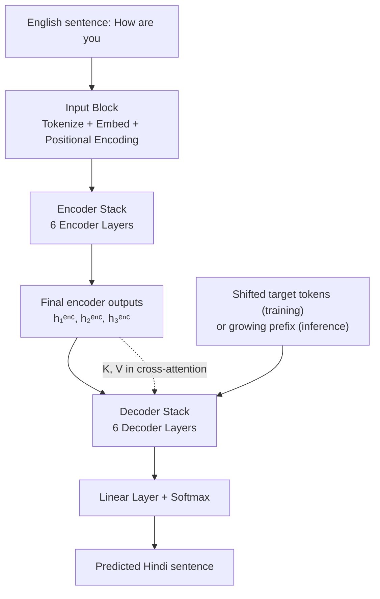
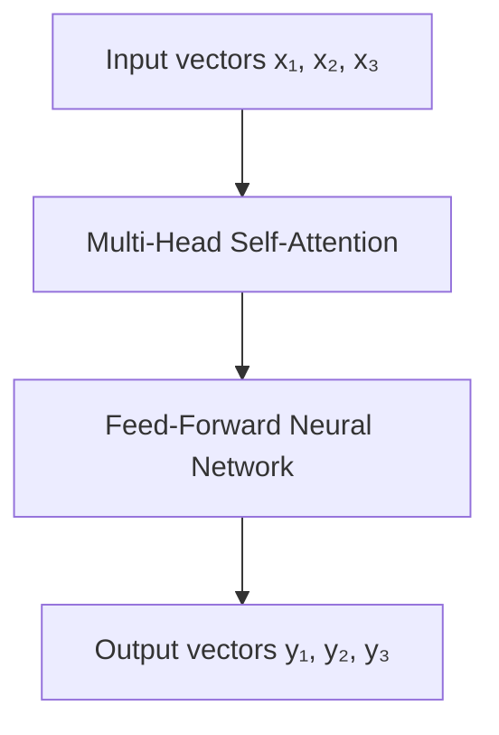
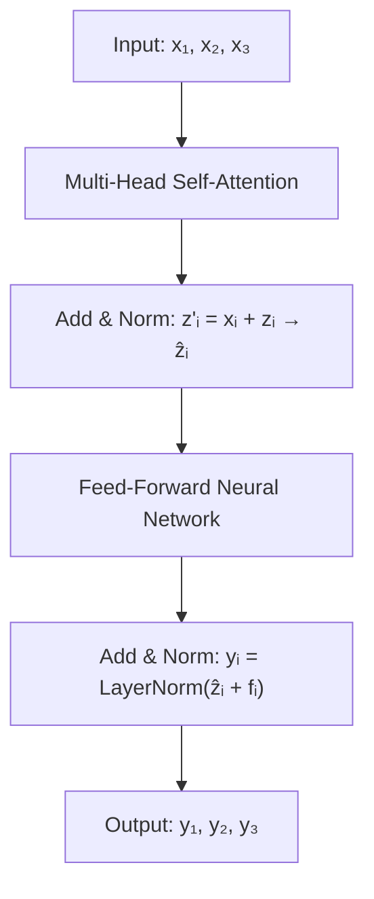
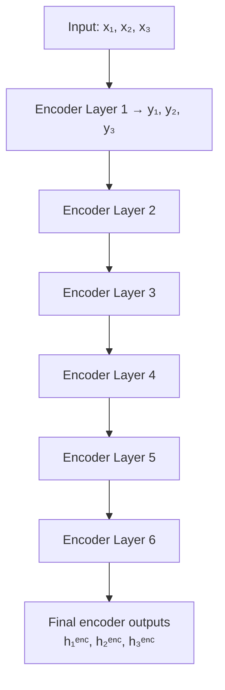
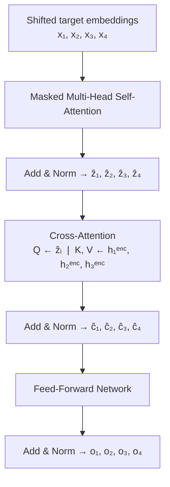
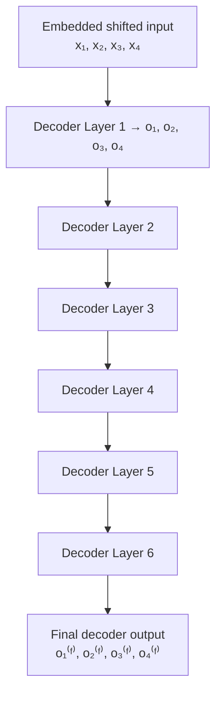
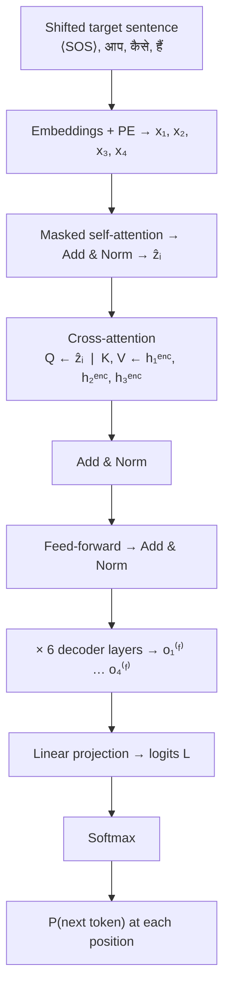
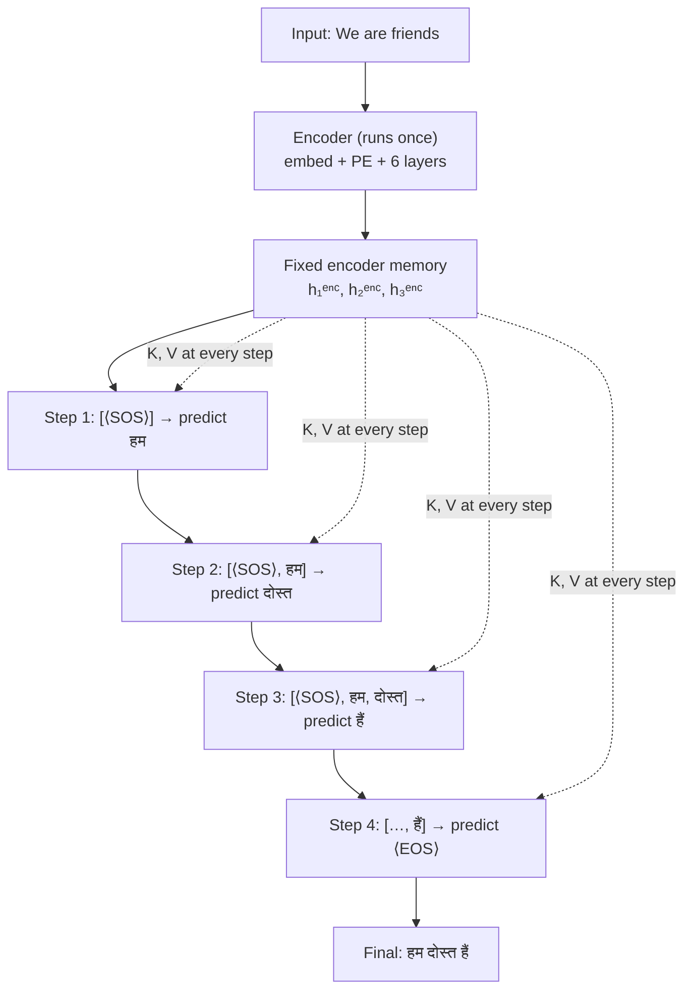
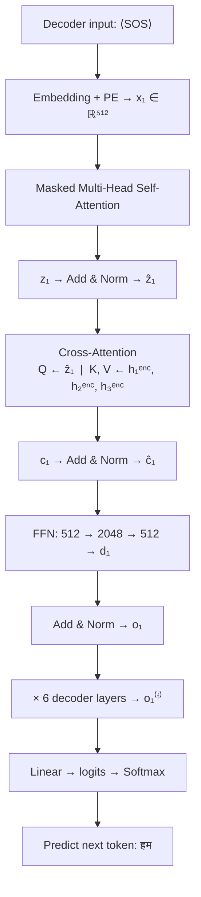
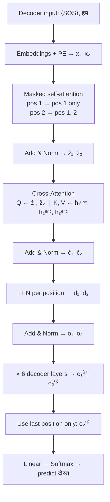

# Understanding the Transformer Architecture

The Transformer architecture, introduced in the *Attention Is All You Need* paper in 2017, turned out to be one of the most important breakthroughs in modern deep learning. In many ways, it became the foundational building block behind a huge number of AI systems we use today. Most modern AI applications, directly or indirectly, are built on top of ideas that came from this architecture.

So naturally, it becomes important for us to understand what this architecture actually is, how it is structured, and what exactly is happening under the hood when a Transformer processes information.

That is exactly what we will be doing in this blog.

## A Few Important Terms Before We Begin

Before we dive into the Transformer architecture itself, there are a couple of technical ideas we need to be comfortable with. Two of the most important ones are:

1. **Masked self-attention**
2. **Cross-attention**

If these terms feel unfamiliar right now, that is completely fine. The goal here is not to master them in isolation, but to build just enough intuition so that the full Transformer architecture makes sense when we finally assemble it.

## Masked Self-Attention

Masked self-attention is essentially a special variant of the self-attention mechanism we have already studied. More specifically, it is a version of **multi-head self-attention** in which certain positions are deliberately hidden from the model.

But why do we even need such a thing?

To understand that, we need to briefly talk about how the **decoder** behaves during **training** and **inference**.

### Why the Decoder Needs Masking

The decoder in a Transformer is responsible for generating the output sequence token by token. For example, if the model is doing machine translation, the decoder is the part that generates the translated sentence.

Now, the decoder operates differently during training and inference:

* **During training**, the correct target sentence is already available in the dataset.
* **During inference**, the correct target sentence is not available, so the model has to generate it one token at a time on its own.

This is where the idea of **autoregression** comes in.

### What Does *Autoregressive* Mean?

In deep learning, an **autoregressive** model generates the current output token by conditioning on the tokens that came before it.

So if the decoder has already generated:

> *I love*

then the next token it predicts will depend on those previous tokens. In other words, every new token is built on top of the tokens generated earlier.

This makes inference naturally **sequential**:

* first generate token 1,
* then use it to generate token 2,
* then use both to generate token 3,
* and so on.

### Training vs Inference in the Decoder

At inference time, the decoder has no access to the future output tokens, because they simply do not exist yet. It only has access to the tokens it has generated so far.

During training, however, the full target sentence is already known. So technically, all target tokens are present at once. This is useful because it allows us to process the whole sequence in parallel and train much faster.

But there is a catch.

If we let the decoder freely attend to **future target tokens** during training, then it would be learning under conditions that will never exist at inference time. During inference, the model will never get to peek at the future words of the sentence it is trying to generate.

So we need a mechanism that enforces the same causal constraint during training as well:

> When predicting the token at position $t$, the decoder should only be allowed to look at tokens up to position $t$, and not beyond that.

That mechanism is **masking**.

This is the core reason masking is required during training. The decoder is supposed to follow the same causal rule in both phases: when predicting position $t$, use only what came before it, never future target tokens. During training, the full shifted target sequence is already available, so without masking the decoder could look ahead and cheat, attending to tokens it would never have access to during inference. That mismatch would make training useless. During inference, future tokens are not available anyway, but the decoder still operates under that same causal left-to-right structure. Masking in training enforces the same information constraint that naturally exists during inference.

### What Exactly Is Masking?

Masking is simply a way of telling the attention mechanism:

> "For this position, do not look at certain other positions."

In the decoder, we use a **causal mask** (also called a **look-ahead mask**) so that when the model is predicting a token at position $t$, it cannot attend to tokens at positions $t+1, t+2, \ldots$.

So if the target sequence is (with $y_4$ being the end-of-sentence token):

$$
[y_1,\ y_2,\ y_3,\ y_4]
$$

and the decoder receives the right-shifted input:

$$
[\langle\text{SOS}\rangle,\ y_1,\ y_2,\ y_3]
$$

then at each position the model predicts the next target token while being allowed to attend only to the current and earlier **decoder-input** positions:

* at position 1 (input: $\langle\text{SOS}\rangle$), predict $y_1$; attend only to position 1
* at position 2 (input: $y_1$), predict $y_2$; attend to positions 1 and 2
* at position 3 (input: $y_2$), predict $y_3$; attend to positions 1, 2, and 3
* at position 4 (input: $y_3$), predict $y_4$ (the end-of-sentence token); attend to positions 1, 2, 3, and 4

but it must **not** attend to any future decoder-input position.

### How Is the Mask Applied?

In practice, the mask is applied to the attention score matrix before the softmax step.

Recall that in attention, we compute scores of the form:

$$
\text{score}(i, j) = \vec{q}_i \cdot \vec{k}_j
$$

These scores tell us how much token $i$ should attend to token $j$. In the actual Transformer, each score is **scaled** by $1/\sqrt{d_k}$ (where $d_k$ is the key dimension) before softmax, so large dot products do not squash the distribution. Compactly, for matrices $\mathbf{Q}$, $\mathbf{K}$, $\mathbf{V}$ stacked row-wise from the position vectors:

$$
\text{Attention}(\mathbf{Q}, \mathbf{K}, \mathbf{V}) = \text{softmax}\!\left(\frac{\mathbf{Q}\mathbf{K}^\top}{\sqrt{d_k}} + \mathbf{M}\right)\mathbf{V}
$$

where $\mathbf{M}$ is the causal mask in decoder self-attention (large negative entries above the diagonal) and is omitted in encoder self-attention and cross-attention.

Now, if token $j$ is a future token that token $i$ should not be allowed to see, we do not literally remove it from the matrix. Instead, we set its score to a very large negative number (conceptually $-\infty$) before applying softmax.

Once softmax is applied, that position gets probability almost equal to zero, which means it contributes nothing to the weighted sum.

So masking does **not** delete tokens. It simply ensures that forbidden positions receive zero attention.

### So Why Is Masked Self-Attention Needed?

Because we want the decoder to learn under the same information constraints that it will face at inference time.

* At **inference**, future output tokens are unavailable.
* Therefore, during **training**, we must also prevent the decoder from using future output tokens.

Masked self-attention is the mechanism that makes this possible. It allows us to keep training efficient by processing the whole target sequence in parallel, while still preserving the causal structure of sequence generation.

## Cross-Attention

The second idea we need to understand is **cross-attention**.

In the **encoder**, we use regular **self-attention**. That means each input token attends to other input tokens in the same sequence.

But inside the **decoder**, there is another attention block that behaves differently. This one is called **cross-attention**.

### Why Is It Called Cross-Attention?

It is called cross-attention because the interaction is happening **across two different sequences**:

* the **decoder sequence** on one side
* the **encoder output sequence** on the other

In this attention block:

* the **Query** vectors come from the decoder
* the **Key** vectors come from the encoder outputs
* the **Value** vectors also come from the encoder outputs

So unlike self-attention, where $\mathbf{Q}$, $\mathbf{K}$, and $\mathbf{V}$ all come from the same sequence, here they come from **two different places**. That is exactly why it is called **cross-attention**. In matrix form, with $\mathbf{Q}$ from the decoder and $\mathbf{K}$, $\mathbf{V}$ from the encoder outputs:

$$
\text{Attention}(\mathbf{Q}, \mathbf{K}, \mathbf{V}) = \text{softmax}\!\left(\frac{\mathbf{Q}\mathbf{K}^\top}{\sqrt{d_k}}\right)\mathbf{V}
$$

### What Is Cross-Attention Trying to Do?

The job of cross-attention is to let the decoder look back at the input sentence and figure out which input tokens are most relevant for generating the current output token.

For example, suppose the input sentence is in English and the decoder is generating its French translation. While producing a particular French word, the decoder may need to focus more strongly on one or two specific English words from the input.

Cross-attention enables exactly that. It helps answer questions like:

* Which parts of the input are relevant right now?
* Which source words should the decoder focus on while generating this target word?
* How strongly is the current output token related to different input tokens?

So you can think of cross-attention as the bridge between the **source sequence** and the **target sequence**.

### Intuition in One Line

If masked self-attention in the decoder helps the model look at the **previous output tokens**, then cross-attention helps it look at the **input sequence from the encoder**.

And together, these two mechanisms allow the decoder to do its job: stay consistent with what it has already generated, while also staying grounded in the original input sequence.

Both of these will become much clearer once we actually build the full Transformer block by block.

## Looking at the Transformer Architecture

Now that the prerequisite ideas are in place, let us finally look at the Transformer architecture itself.

At a very high level, a Transformer can be thought of as one large box containing **two smaller boxes**:

1. an **Encoder**
2. a **Decoder**

That is the entire architecture at the highest level.

> **A note on scope:** This blog covers the original **encoder–decoder Transformer** from *Attention Is All You Need* (Vaswani et al., 2017). Many modern large language models — GPT, LLaMA, and similar systems — are **decoder-only** architectures that drop the encoder entirely. The ideas here are foundational to all of them, but the specific two-component structure we are about to walk through is the original encoder–decoder design.

In the original *Attention Is All You Need* paper, the Transformer was built using **6 encoder layers** and **6 decoder layers** stacked one after another. This number is not sacred. There is nothing magical about "6" in itself. It was simply the configuration used in the original paper, and it worked well. In modern implementations, the number of encoder and decoder layers can absolutely vary depending on the problem, the model size, and the available compute.

One more important thing: all encoder layers have the **same architecture**, and all decoder layers also have the **same architecture**. That means structurally they are identical. However, that does **not** mean they share the same learned parameters. Each encoder layer has its own weights, and each decoder layer has its own weights.

So when we say that all six encoders are "the same," we mean **architecturally identical**, not **parameter-tied**.

<figure class="transformer-figure">
  
  <figcaption>The original encoder–decoder Transformer architecture (Vaswani et al., 2017).</figcaption>
</figure>

## The Running Example We Will Use

To make the entire working of the Transformer concrete, let us carry one example throughout the rest of this blog.

Suppose we are training a Transformer for **machine translation**, where the task is to translate English sentences into Hindi.

Now of course, in practice, the dataset would contain thousands or lakhs of sentence pairs. But for the sake of intuition, let us pretend that our dataset contains just a single training example:

* **Input sentence (English):** `How are you`
* **Target sentence (Hindi):** `आप कैसे हैं`

We will keep using this example throughout the explanation so that the architecture does not remain abstract.

Also, one more simplification: in practice, models are trained on **batches** of sentences, not on one sentence at a time. But here, for intuition, we will assume a batch size of 1, containing only this single example.

## The Transformer at a High Level

Before zooming into the encoder, let us first look at the broad flow of the entire Transformer.

For now, do not worry too much about the decoder side. We will get there. Let us first understand the **encoder** properly.

## The Encoder Block at a High Level

If we zoom into a single encoder layer, then that encoder layer itself can be thought of as a box containing **two main sub-blocks**:

1. **Multi-head self-attention**
2. **A feed-forward neural network**

That is the encoder at a high level. The real encoder layer also contains **residual connections** and **layer normalization**, and we will absolutely discuss them. But for the moment, if you want the most stripped-down mental model, then this is the encoder:

We will now build this block from the ground up.

## Step 1: What Happens in the Input Block?

Before the sentence can even enter the first encoder layer, it has to pass through an **input block**. This block performs three important operations:

1. **Tokenization**
2. **Embedding lookup**
3. **Adding positional encodings**

Let us go one by one.

### 1. Tokenization

We start with the input sentence:

$$
\texttt{How are you}
$$

This sentence is first broken into tokens. For simplicity, let us assume the tokenizer splits it into exactly three tokens:

$$
[\texttt{How},\ \texttt{are},\ \texttt{you}]
$$

In practice, tokenization can be more sophisticated than this. Modern tokenizers often break text into **subwords** rather than full words. But for intuition, this simple split is completely fine.

So we now have three input tokens:

* $w_1 = \texttt{How}$
* $w_2 = \texttt{are}$
* $w_3 = \texttt{you}$

### 2. Embedding Lookup

Once the tokens are obtained, each token is converted into a dense vector representation using an **embedding layer**.

So we get:

$$
\vec{e}_{\texttt{How}},\quad \vec{e}_{\texttt{are}},\quad \vec{e}_{\texttt{you}}
$$

These are the embedding vectors for the three tokens. In the original Transformer paper, the model dimension was:

$$
d_{\text{model}} = 512
$$

which means each embedding vector lives in $\mathbb{R}^{512}$:

$$
\vec{e}_{\texttt{How}},\ \vec{e}_{\texttt{are}},\ \vec{e}_{\texttt{you}} \in \mathbb{R}^{512}
$$

(In the original paper, these embeddings are also scaled by $\sqrt{d_{\text{model}}}$ before positional encodings are added; we omit that factor here because it does not change the conceptual picture.)

At this stage, these are just **token embeddings**. They capture the identity and semantics of the token to some extent, but they do **not** yet tell the model anything about **where** the token occurred in the sentence.

And that is a problem, because the Transformer has no recurrence and no convolution. On its own, it has no built-in notion of order. That is exactly why we need positional encodings.

### 3. Adding Positional Encodings

For each token position, we create a positional encoding vector:

$$
\vec{p}_1,\ \vec{p}_2,\ \vec{p}_3
$$

where:

* $\vec{p}_1$ corresponds to the position of `How`
* $\vec{p}_2$ corresponds to the position of `are`
* $\vec{p}_3$ corresponds to the position of `you`

These positional encoding vectors are then **added element-wise** to the corresponding token embeddings:

$$
\vec{x}_1 = \vec{e}_{\texttt{How}} + \vec{p}_1
$$

$$
\vec{x}_2 = \vec{e}_{\texttt{are}} + \vec{p}_2
$$

$$
\vec{x}_3 = \vec{e}_{\texttt{you}} + \vec{p}_3
$$

So now:

* $\vec{x}_1$ is the final input representation for `How`
* $\vec{x}_2$ is the final input representation for `are`
* $\vec{x}_3$ is the final input representation for `you`

These vectors are what actually get fed into the first encoder layer.

If you want to understand positional encodings in depth, I have already written a separate blog on them [here↗](/writings/positional_encoding_explained). I will not go too deep into that rabbit hole here.

### So Where Are We Right Now?

At this point, the sentence

$$
\texttt{How are you}
$$

has been transformed into three vectors:

$$
\vec{x}_1,\ \vec{x}_2,\ \vec{x}_3
$$

where each vector contains:

* the semantic information of the token through its embedding
* the positional information of where that token occurred in the sentence

These vectors are now ready to enter the **first encoder layer**, where self-attention will begin doing its work.

### Notation Reference

Before we walk through the encoder layer in detail, here is a compact reference for the main vectors we will use in this section (encoder-side):

| Symbol | Meaning |
|:---|:---|
| $\vec{e}_{\texttt{w}}$ | Token embedding for token $\texttt{w}$ |
| $\vec{p}_i$ | Positional encoding vector at position $i$ |
| $\vec{x}_i$ | Input representation: embedding + positional encoding |
| $\vec{z}_i$ | Multi-head self-attention output at position $i$ |
| $\vec{z}'_i$ | Post-residual sum: $\vec{x}_i + \vec{z}_i$ |
| $\hat{\vec{z}}_i$ | Post Add & Norm after self-attention |
| $\vec{y}_i$ | Output of one encoder layer at position $i$ |
| $\vec{h}^{\,\text{enc}}_i$ | Final encoder output (encoder memory) at position $i$ |
| $\vec{o}^{(F)}_i$ | Final decoder layer output at position $i$ |

(Later, when we move to the decoder, $\vec{x}_i$, $\vec{z}_i$, and $\hat{\vec{z}}_i$ refer to **decoder-side** vectors with the same structural roles but separate learned parameters.)

## Inside the Encoder Layer

Now that we have the positional-encoded input vectors

$$
\vec{x}_1,\ \vec{x}_2,\ \vec{x}_3
$$

we can finally feed them into the **encoder layer**.

At a high level, an encoder layer performs two major operations:

1. **Multi-head self-attention**
2. **A position-wise feed-forward neural network**

with **residual connections** and **layer normalization** wrapped around both of them.

So let us go through this entire flow carefully.

### Step 2: Multi-Head Self-Attention

The three input vectors $\vec{x}_1,\ \vec{x}_2,\ \vec{x}_3$ enter the **multi-head self-attention block**.

We have already studied self-attention and multi-head attention separately [here↗](/writings/self_attention), so I will not re-derive the whole mechanism here. For now, all we need to know is this:

* the input to the self-attention block is the sequence of vectors $\vec{x}_1,\ \vec{x}_2,\ \vec{x}_3$
* the output is another sequence of vectors of the **same dimensionality**

So after the multi-head attention block, we obtain:

$$
\vec{z}_1,\ \vec{z}_2,\ \vec{z}_3
$$

where each of these vectors is still **512-dimensional**. That dimensional consistency is important. So far, every token representation we have worked with — the token embeddings $\vec{e}_{\texttt{w}}$, the positional encoding vectors $\vec{p}_i$, the combined input vectors $\vec{x}_i$, and now the self-attention outputs $\vec{z}_i$ — all live in the same model space of dimension $d_{\text{model}} = 512$ in the original Transformer.

### Step 3: Residual Connection Around Self-Attention

Now comes the next part of the encoder layer: the **residual connection**.

The input vectors $\vec{x}_1,\ \vec{x}_2,\ \vec{x}_3$ do not only go through the multi-head attention block. They also take a second route: they are passed forward directly and later added back to the output of the attention block.

So if the attention block produces $\vec{z}_1,\ \vec{z}_2,\ \vec{z}_3$, then we perform the following addition:

$$
\vec{z}'_1 = \vec{x}_1 + \vec{z}_1
$$

$$
\vec{z}'_2 = \vec{x}_2 + \vec{z}_2
$$

$$
\vec{z}'_3 = \vec{x}_3 + \vec{z}_3
$$

or more compactly, if we stack everything into matrices:

$$
\mathbf{Z}' = \mathbf{X} + \mathbf{Z}
$$

where:

* $\mathbf{X}$ is the matrix formed by stacking $\vec{x}_1,\ \vec{x}_2,\ \vec{x}_3$
* $\mathbf{Z}$ is the output of the multi-head attention block
* $\mathbf{Z}'$ is the result after the residual addition

This is the **Add** part of the famous **Add & Norm** block in the original Transformer architecture. The ordering described here — sub-block, residual add, then layer norm — is the **post-layer-norm** layout from the original paper. Many modern implementations use a **pre-LN** variant instead; the underlying ideas are the same, only the placement of normalization differs.

### Why Do We Use Residual Connections?

At an intuitive level, a residual connection gives the network a direct path to preserve the original information while also learning a refined version of it through the attention block.

So instead of forcing the layer to completely overwrite the old representation, we let it learn a **correction** or **update** on top of what was already there. This helps with stable optimization, better gradient flow, easier training of deep stacks of layers, and preserving useful information from earlier representations.

So the output after this step is not "only what attention produced," but rather:

> the original token representation **plus** the contextual update learned by self-attention.

### Step 4: Layer Normalization

Once the residual addition is done, the next step is **layer normalization**.

So the vectors $\vec{z}'_1,\ \vec{z}'_2,\ \vec{z}'_3$ are passed through a layer normalization operation, producing:

$$
\hat{\vec{z}}_1,\ \hat{\vec{z}}_2,\ \hat{\vec{z}}_3
$$

So mathematically:

$$
\hat{\vec{z}}_i = \text{LayerNorm}(\vec{z}'_i)
$$

or in matrix form:

$$
\hat{\mathbf{Z}} = \text{LayerNorm}(\mathbf{Z}')
$$

At an intuitive level, layer normalization rescales the **feature dimensions within each individual token vector**, keeping activations in a stable range. It does **not** normalize across tokens in the sequence, and it does **not** produce probabilities — that is the job of softmax, which comes much later at the vocabulary projection step.

So after the **self-attention + residual + layer norm** stage, we now have the normalized vectors:

$$
\hat{\vec{z}}_1,\ \hat{\vec{z}}_2,\ \hat{\vec{z}}_3
$$

These are the vectors that will now enter the second major sub-block of the encoder: the **feed-forward neural network**.

### Step 5: Stacking the Token Representations into a Matrix

Before passing the sequence through the feed-forward network, let us represent the three normalized vectors together as a matrix:

$$
\hat{\mathbf{Z}} =
\begin{bmatrix}
\hat{\vec{z}}_1 \\
\hat{\vec{z}}_2 \\
\hat{\vec{z}}_3
\end{bmatrix}
$$

Since we have **3 tokens**, and each token representation has **512 dimensions**, the shape of this matrix is:

$$
3 \times 512
$$

That is 3 rows, one per token, and 512 columns, one per feature dimension. This matrix is what goes into the feed-forward network.

### Step 6: The Feed-Forward Neural Network

After self-attention, every token has already gathered contextual information from the other tokens in the sentence. The next step is to pass each of these token representations through a **feed-forward neural network**.

This feed-forward network is the **same network for every token position**. In other words, the transformation is applied independently to each row of the matrix, but the weights are shared across all positions. This is why it is often called a **position-wise feed-forward network**.

#### Architecture of the Feed-Forward Network

In the original Transformer, this feed-forward network has two linear layers with a ReLU non-linearity in between.

**Input layer:** dimension $512$, because each token representation is 512-dimensional.

**Hidden layer:** dimension $2048$. The weight matrix connecting the input to the hidden layer is:

$$
W_1 \in \mathbb{R}^{512 \times 2048}
$$

and the bias vector is:

$$
b_1 \in \mathbb{R}^{2048}
$$

The activation function used after this layer is **ReLU**.

**Output layer:** maps the representation back from 2048 dimensions to 512 dimensions.

$$
W_2 \in \mathbb{R}^{2048 \times 512}
$$

$$
b_2 \in \mathbb{R}^{512}
$$

This final layer uses a linear transformation with no additional nonlinearity inside the FFN block.

#### Why Expand from 512 to 2048 and Then Come Back to 512?

If we start with a 512-dimensional vector and end with a 512-dimensional vector, why bother expanding it to 2048 dimensions in the middle?

The answer is that this hidden expansion gives the model more expressive capacity. The intermediate layer allows the network to learn richer nonlinear transformations of the token representation.

So the self-attention block mixes information **across tokens**, and then the feed-forward network performs a deeper nonlinear transformation **within each token representation** after context has already been mixed in. That division of labor is useful.

#### Mathematical Form of the Feed-Forward Network

For a single token representation $\vec{u}$, the feed-forward network can be written as:

$$
\text{FFN}(\vec{u}) = \text{ReLU}(\vec{u}W_1 + b_1)W_2 + b_2
$$

Now in our case, we are not feeding just one token vector but the whole matrix $\hat{\mathbf{Z}} \in \mathbb{R}^{3 \times 512}$. So the same expression becomes:

$$
\mathbf{F} = \text{ReLU}(\hat{\mathbf{Z}}W_1 + b_1)W_2 + b_2
$$

where $b_1$ and $b_2$ are broadcast across all token positions (i.e., added to every row), and $\mathbf{F}$ is the output matrix of the feed-forward network. If we denote its rows by $\vec{f}_1,\ \vec{f}_2,\ \vec{f}_3$, then:

$$
\mathbf{F} =
\begin{bmatrix}
\vec{f}_1 \\
\vec{f}_2 \\
\vec{f}_3
\end{bmatrix}
$$

and each of these vectors is again 512-dimensional.

So after the feed-forward block, we still have one vector per token, and each vector still lives in the same 512-dimensional model space.

### Step 7: Another Residual Connection and Another Layer Normalization

The encoder layer is still not over.

Just like we wrapped the self-attention block with **Add & Norm**, we do the same thing for the feed-forward block as well.

The input to the feed-forward network was $\hat{\mathbf{Z}}$, and the output is $\mathbf{F}$. So we first add them:

$$
\mathbf{F}' = \hat{\mathbf{Z}} + \mathbf{F}
$$

and then apply layer normalization:

$$
\mathbf{Y} = \text{LayerNorm}(\mathbf{F}')
$$

If we denote the final output rows by $\vec{y}_1,\ \vec{y}_2,\ \vec{y}_3$, then the encoder layer finally outputs:

$$
\vec{y}_1,\ \vec{y}_2,\ \vec{y}_3
$$

These are the final representations produced by **one encoder layer**.

### So What Did One Encoder Layer Actually Do?

If we zoom out, one encoder layer took the input token representations $\vec{x}_1,\ \vec{x}_2,\ \vec{x}_3$ and transformed them through the following sequence of steps:

1. **Multi-head self-attention**
2. **Residual addition**
3. **Layer normalization**
4. **Feed-forward neural network**
5. **Residual addition**
6. **Layer normalization**

In compact form, the encoder layer looks like this:

The output of one encoder layer becomes the input to the next encoder layer.

## Stacking Encoder Layers

What we just walked through was the computation happening inside one encoder layer.

But the original Transformer does not contain just one encoder layer. It contains a **stack of 6 encoder layers** placed one after another.

So if the first encoder layer outputs the vectors $\vec{y}_1,\ \vec{y}_2,\ \vec{y}_3$, then those vectors become the input to the second encoder layer. The output of the second encoder layer becomes the input to the third encoder layer, and this process continues all the way up to the sixth encoder layer. Only the **first** encoder layer receives the embedded, positional-encoded input vectors $\vec{x}_1,\ \vec{x}_2,\ \vec{x}_3$; every subsequent layer receives the previous layer's output vectors.

So the flow looks like this:

Each encoder layer takes the token representations it receives, refines them using self-attention and a feed-forward network, and passes the updated representations to the next encoder layer.

By the time the sequence reaches the top of the encoder stack, each token representation has been repeatedly contextualized and transformed across multiple layers.

The output of the 6th encoder layer is what we call the **final encoder outputs** or **encoder memory**. We will denote these as:

$$
\vec{h}^{\,\text{enc}}_1,\ \vec{h}^{\,\text{enc}}_2,\ \vec{h}^{\,\text{enc}}_3
$$

where each $\vec{h}^{\,\text{enc}}_i \in \mathbb{R}^{512}$ is a rich, contextualized representation of the corresponding source token. These vectors are extremely important, because they are what the decoder later uses during the cross-attention step. When the decoder is trying to generate the output sequence, this encoder memory is the information it looks back at in order to stay grounded in the original input sentence.

So the encoder has now transformed the source sentence `How are you` into a set of deeply contextualized source-side representations. The decoder's job is to use those representations while generating the target sequence. With that in mind, let us now move from "how the input sentence is encoded" to "how the output sentence is generated."

## Understanding the Decoder During Training

Now that the encoder side is complete, let us move to the second half of the Transformer architecture: the **decoder**.

The decoder is the more interesting part of the Transformer, because unlike the encoder, its behavior differs between **training** and **inference**.

The encoder does not really care whether we are in training mode or inference mode. It simply takes the input sentence, processes it through its stack of encoder layers, and produces contextual representations of the source sequence.

The **decoder**, however, is different. Its job is to **generate the target sequence**, and because of that, the way it operates during training is not exactly the same as the way it operates during inference.

So to keep things clean, we will first understand the **decoder during training**. Later, we will separately look at what changes during inference.

### What Goes Into the Decoder During Training?

Recall our running example:

* **Source sentence (input to encoder):** `How are you`
* **Target sentence (what we want to generate):** `आप कैसे हैं`

Now, during training, the decoder does **not** receive the target sentence in its raw form. Instead, it receives a **right-shifted** version of the target sequence.

Conceptually, the **target sequence** the model is learning to generate is:

$$
[\text{आप},\ \text{कैसे},\ \text{हैं},\ \langle\text{EOS}\rangle]
$$

The decoder **input** during training is the right-shifted version that begins with $\langle\text{SOS}\rangle$:

$$
[\langle\text{SOS}\rangle,\ \text{आप},\ \text{कैसे},\ \text{हैं}]
$$

where $\langle\text{SOS}\rangle$ is the **start-of-sentence** token and $\langle\text{EOS}\rangle$ is the **end-of-sentence** token.

So the decoder is effectively being told: start with $\langle\text{SOS}\rangle$, then see `आप`, then see `कैसे`, then see `हैं`, and at each position predict the **next** token in the target sequence above.

### A Small but Important Clarification About Training

At this point, it is tempting to say that during training the decoder behaves in a "non-autoregressive" way because all target tokens are fed at once.

But the more accurate way to think about it is this: the decoder is still learning an **autoregressive next-token prediction task**. However, **training can be parallelized** because the full shifted target sequence is already known.

So yes, all decoder input tokens are available during training and can be processed together in a single forward pass. But because of **masking**, each position is still only allowed to attend to itself and the tokens before it, not to future ones. That is how the decoder preserves the same causal structure that it will later face at inference time. This setup is a form of **teacher forcing**: the decoder is fed the ground-truth previous target tokens during training, rather than its own predictions.

### Training-Time Next-Token Prediction Setup

To make this concrete, here is the relationship between decoder inputs and training targets in our running example:

| Decoder input | $\langle\text{SOS}\rangle$ | आप | कैसे | हैं |
|:---|:---|:---|:---|:---|
| **Prediction target** | आप | कैसे | हैं | $\langle\text{EOS}\rangle$ |

So the training objective is:

* at position 1 (decoder input: $\langle\text{SOS}\rangle$), predict `आप`
* at position 2 (decoder input: `आप`), predict `कैसे`
* at position 3 (decoder input: `कैसे`), predict `हैं`
* at position 4 (decoder input: `हैं`), predict $\langle\text{EOS}\rangle$

This is why the decoder input is right-shifted in the first place: at each position, the model sees all tokens up to and including the current one, and is asked to predict the **next** token in the target sequence.

### Decoder Input Processing

The shifted target sequence

$$
[\langle\text{SOS}\rangle,\ \text{आप},\ \text{कैसे},\ \text{हैं}]
$$

goes through the same kind of **input block** that we saw on the encoder side:

1. tokenization
2. embedding lookup
3. addition of positional encodings

Let the final positional-encoded decoder input vectors be:

$$
\vec{x}_1,\ \vec{x}_2,\ \vec{x}_3,\ \vec{x}_4
$$

corresponding to:

* $\vec{x}_1$ for $\langle\text{SOS}\rangle$
* $\vec{x}_2$ for `आप`
* $\vec{x}_3$ for `कैसे`
* $\vec{x}_4$ for `हैं`

(We are reusing the $\vec{x}_i$ notation here for the decoder input vectors, just as we used it for the encoder input vectors. The encoder and decoder have structurally identical input pipelines — same steps, same notation — but these are entirely different vectors with separate learned embeddings and positional encodings.)

These four vectors are what enter the **first decoder layer**.

## Inside a Decoder Layer

> **Notation note:** From this point forward, $\vec{x}_i$, $\vec{z}_i$, $\hat{\vec{z}}_i$, and related symbols refer to **decoder-side** vectors, not the encoder-side vectors of the same names introduced earlier. The encoder and decoder use structurally identical notation because they perform analogous operations — but the actual vectors and learned parameters are completely separate.

At a high level, a decoder layer contains **three** major sub-blocks:

1. **Masked multi-head self-attention**
2. **Cross-attention**
3. **A feed-forward neural network**

And just like the encoder, each of these major computations is wrapped with **residual connections** and **layer normalization**.

So let us walk through the decoder layer step by step.

### Step 1: Masked Multi-Head Self-Attention

The four decoder input vectors $\vec{x}_1,\ \vec{x}_2,\ \vec{x}_3,\ \vec{x}_4$ first enter a **masked multi-head self-attention** block.

This is similar to the self-attention block we saw in the encoder, with one crucial difference:

> the decoder is **not allowed to attend to future target tokens**.

So when the decoder is processing position 3, it can look at positions 1, 2, and 3, but **not** position 4. Likewise, when it is processing position 2, it can only look at positions 1 and 2.

This masking is necessary because during inference, the future target tokens do not exist yet. So even during training, we must prevent the decoder from cheating by looking ahead.

Let the output of this masked self-attention block be:

$$
\vec{z}_1,\ \vec{z}_2,\ \vec{z}_3,\ \vec{z}_4
$$

As always, each of these vectors is still **512-dimensional**.

### Step 2: Residual Connection + Layer Normalization

Just like in the encoder, the decoder input vectors also travel through a residual path.

So the original decoder input vectors $\vec{x}_1,\ \vec{x}_2,\ \vec{x}_3,\ \vec{x}_4$ are added back to the output of the masked self-attention block:

$$
\vec{z}'_i = \vec{x}_i + \vec{z}_i \quad \text{for } i = 1, 2, 3, 4
$$

These vectors are then passed through layer normalization:

$$
\hat{\vec{z}}_i = \text{LayerNorm}(\vec{z}'_i) \quad \text{for } i = 1, 2, 3, 4
$$

So at this point, we have completed the **first Add & Norm block** of the decoder layer.

These normalized vectors $\hat{\vec{z}}_1,\ \hat{\vec{z}}_2,\ \hat{\vec{z}}_3,\ \hat{\vec{z}}_4$ now move into the second major component of the decoder: **cross-attention**.

### Step 3: Cross-Attention

This is where the decoder finally gets access to the information coming from the encoder.

Recall that after the encoder stack finished processing the source sentence `How are you`, it produced the final encoder outputs:

$$
\vec{h}^{\,\text{enc}}_1,\ \vec{h}^{\,\text{enc}}_2,\ \vec{h}^{\,\text{enc}}_3
$$

where each of these vectors is 512-dimensional. These are the deeply contextualized source-side representations that the encoder computed. They are now fed into the **cross-attention** block of the decoder.

In this block:

* the **Query** vectors are computed from the decoder-side normalized representations $\hat{\vec{z}}_1,\ \hat{\vec{z}}_2,\ \hat{\vec{z}}_3,\ \hat{\vec{z}}_4$
* the **Key** vectors are computed from the final encoder outputs $\vec{h}^{\,\text{enc}}_1,\ \vec{h}^{\,\text{enc}}_2,\ \vec{h}^{\,\text{enc}}_3$
* the **Value** vectors are also computed from the final encoder outputs $\vec{h}^{\,\text{enc}}_1,\ \vec{h}^{\,\text{enc}}_2,\ \vec{h}^{\,\text{enc}}_3$

A shape note worth keeping in mind: since the decoder currently has 4 positions and the encoder has 3, the score matrix $\mathbf{Q}\mathbf{K}^\top$ here has shape $4 \times 3$. Each of the 4 decoder positions produces a distribution over the 3 encoder positions. The output of cross-attention therefore has shape $4 \times d_{\text{model}}$, matching the decoder sequence length.

This is exactly why it is called **cross-attention**: the attention is happening across two different sequences, one belonging to the decoder and the other belonging to the encoder.

### Intuition Behind Cross-Attention

At this point, the decoder already knows two things:

1. what it has generated so far on the target side
2. where it currently is in the target sequence

But that is not enough. It also needs to know which parts of the input sentence are relevant for generating the current output token.

That is the job of cross-attention.

For example, while generating the Hindi token `कैसे`, the decoder may need to pay strong attention to the English word `are`. While generating `आप`, it may need to attend more strongly to `you`. Cross-attention lets the decoder look back at the encoder's representation of the source sentence and decide which source-side information matters most at the current decoding step.

### Output of the Cross-Attention Block

Let the output of this cross-attention block be:

$$
\vec{c}_1,\ \vec{c}_2,\ \vec{c}_3,\ \vec{c}_4
$$

where each $\vec{c}_i$ is again a 512-dimensional vector. These are now decoder-side representations that have been updated using information from the encoder outputs.

### Step 4: Residual Connection + Layer Normalization Again

Now we perform the second **Add & Norm** step of the decoder.

The input to the cross-attention block was $\hat{\vec{z}}_1,\ \hat{\vec{z}}_2,\ \hat{\vec{z}}_3,\ \hat{\vec{z}}_4$, and the output is $\vec{c}_1,\ \vec{c}_2,\ \vec{c}_3,\ \vec{c}_4$. So we add them element-wise:

$$
\vec{c}'_i = \hat{\vec{z}}_i + \vec{c}_i \quad \text{for } i = 1, 2, 3, 4
$$

and then apply layer normalization:

$$
\hat{\vec{c}}_i = \text{LayerNorm}(\vec{c}'_i) \quad \text{for } i = 1, 2, 3, 4
$$

At this point, we have completed the **second Add & Norm block** of the decoder layer.

Now the decoder-side representations have already gone through:

1. masked self-attention
2. residual + layer norm
3. cross-attention with the encoder outputs
4. residual + layer norm

The only major piece left inside the decoder layer is the **feed-forward neural network**.

### Step 5: Feed-Forward Network in the Decoder

At this point, the decoder-side representations $\hat{\vec{c}}_1,\ \hat{\vec{c}}_2,\ \hat{\vec{c}}_3,\ \hat{\vec{c}}_4$ are passed into the **feed-forward neural network** of the decoder layer.

This feed-forward network is **architecturally the same** as the one we saw in the encoder. It is a position-wise feed-forward network consisting of:

1. a linear transformation from **512 to 2048**
2. a **ReLU** non-linearity
3. another linear transformation from **2048 back to 512**

Let the output of this decoder feed-forward block be:

$$
\vec{d}_1,\ \vec{d}_2,\ \vec{d}_3,\ \vec{d}_4
$$

where each $\vec{d}_i \in \mathbb{R}^{512}$.

### Step 6: Residual Connection + Layer Normalization Again

Just like the previous two sub-blocks of the decoder, the feed-forward block is also wrapped with a residual connection and a layer normalization step.

So the input to the feed-forward block, $\hat{\vec{c}}_1,\ \hat{\vec{c}}_2,\ \hat{\vec{c}}_3,\ \hat{\vec{c}}_4$, is added back to its output:

$$
\vec{d}'_i = \hat{\vec{c}}_i + \vec{d}_i \quad \text{for } i = 1, 2, 3, 4
$$

These vectors are then passed through layer normalization:

$$
\vec{o}_i = \text{LayerNorm}(\vec{d}'_i) \quad \text{for } i = 1, 2, 3, 4
$$

So the final output of **one decoder layer** is:

$$
\vec{o}_1,\ \vec{o}_2,\ \vec{o}_3,\ \vec{o}_4
$$

This completes the internal computation of a single decoder layer.

### Decoder Layer Flow Summary

The full internal flow of a single decoder layer during training looks like this:

## Stacking Decoder Layers

Just like the encoder, the decoder also consists of **6 layers** in the original Transformer architecture.

So what we just studied is only the working of **one decoder layer**.

The output of decoder layer 1 — $\vec{o}_1,\ \vec{o}_2,\ \vec{o}_3,\ \vec{o}_4$ — becomes the input to decoder layer 2. The output of decoder layer 2 becomes the input to decoder layer 3. And this continues until the sequence has passed through all **6 decoder layers**. Only the **first** decoder layer receives the embedded, positional-encoded shifted target vectors $\vec{x}_1,\ \vec{x}_2,\ \vec{x}_3,\ \vec{x}_4$; every subsequent layer receives the previous layer's output vectors.

Let the output of the **final decoder layer** be:

$$
\vec{o}^{(F)}_1,\ \vec{o}^{(F)}_2,\ \vec{o}^{(F)}_3,\ \vec{o}^{(F)}_4
$$

where the superscript $F$ simply denotes "final decoder layer output."

If we stack these token representations row-wise, we obtain a matrix of shape:

$$
4 \times 512
$$

because in our running example, the decoder input sequence has 4 tokens:

$$
[\langle\text{SOS}\rangle,\ \text{आप},\ \text{कैसे},\ \text{हैं}]
$$

## Final Linear Layer and Softmax

Now comes the last stage of the decoder during training.

The final decoder output vectors are not yet probabilities over actual words in the target vocabulary. Right now, they are still just 512-dimensional learned representations.

So for each decoder position, we pass the 512-dimensional output vector through a **final linear layer** that projects it into a vector of size $V$, where $V$ is the size of the **target vocabulary**.

So each decoder output vector is transformed as:

$$
\mathbb{R}^{512} \rightarrow \mathbb{R}^{V}
$$

This produces a vector of **logits** for every decoder position.

So if the final decoder output matrix is

$$
\mathbf{O}^{(F)} \in \mathbb{R}^{4 \times 512}
$$

then after the linear projection, we get:

$$
\mathbf{L} \in \mathbb{R}^{4 \times V}
$$

where each row contains the unnormalized scores (logits) for all vocabulary tokens at that decoder position.

### Applying Softmax

These logits are then passed through a **softmax** operation. Softmax converts the logits at each decoder position into a probability distribution over the target vocabulary.

So after softmax, each row tells us: "For this decoder position, what is the probability of every possible token in the target vocabulary?"

So now, for each of the 4 decoder positions in our running example, the model outputs a probability distribution over all Hindi vocabulary tokens.

During training, the predicted probabilities at each position are compared against the ground-truth next tokens, and the model is optimized to increase the probability of the correct next token at every position.

## The Full Decoder Training Flow

If we put everything together, then during training the decoder works like this:

And with that, the **training-time architecture of the Transformer** is essentially complete.

We have now seen:

* how the **encoder** processes the source sentence
* how the **decoder** processes the shifted target sequence during training
* how **masked self-attention** prevents future-token leakage
* how **cross-attention** lets the decoder look back at the encoder outputs
* and how the final decoder representations are converted into token probabilities over the target vocabulary

The only major piece left now is to understand what changes during **inference**, when the decoder no longer has access to the full target sentence and has to generate one token at a time.

## Transformer Decoder During Inference

Now that we have understood how the Transformer behaves during training, let us move to the final missing piece: **inference**.

During inference, the part that actually changes is the **decoder**. The encoder behaves exactly the same way as it did during training. It still takes the source sentence, converts it into embeddings, adds positional encodings, passes everything through 6 encoder layers, and finally produces the **final encoder outputs**. Nothing about the encoder changes between training and inference.

So for the inference discussion, we will focus only on the decoder side.

To make things concrete, let us use a fresh example here.

* **Input English sentence:** `We are friends`
* **Target Hindi sentence:** `हम दोस्त हैं`

The goal of the Transformer during inference is to read the English sentence and generate the Hindi translation **one token at a time**.

### Why Does the Decoder Behave Differently During Inference?

During training, the full target sentence was already available in the dataset. So even though the decoder was still learning an autoregressive task, we could feed the **entire shifted target sequence** into the decoder at once and process all positions in parallel. Masking enforced the causal constraint, but all positions were computed in a single forward pass.

During inference, however, the target sentence is **not known beforehand**. The model has to generate it on its own. That means the decoder cannot receive the full target sequence as input, because the target sequence simply does not exist yet.

Instead, it has to generate the output **token by token**.

So the inference loop works like this:

1. start with only the $\langle\text{SOS}\rangle$ token as the decoder input
2. pass the **entire current prefix** through the full decoder stack (all 6 layers)
3. take the output at the **last decoder position** and pick the most probable next token
4. append that token to the decoder input
5. pass the now-longer prefix through the full decoder stack again
6. again take the output at the last decoder position
7. keep repeating until the model generates $\langle\text{EOS}\rangle$

At every step, the decoder conceptually processes the complete current prefix

$$
[\langle\text{SOS}\rangle,\ t_1,\ t_2,\ \ldots,\ t_{k-1}]
$$

through all six layers, and only the representation at the final position is used to predict $t_k$. (In practice, **KV caching** avoids recomputing keys and values for positions that have already been processed — but the causal structure and the output at each step are identical to this uncached conceptual view.)

This is why inference in a Transformer decoder is **autoregressive and sequential**. Each new token depends on all the previously generated tokens, and those tokens only exist because we generated them one step at a time.

### Step 0: What Happens on the Encoder Side?

Before the decoder even begins generating the output, the encoder has already done its job.

The input sentence is:

$$
\texttt{We are friends}
$$

Let us assume, for simplicity, that it gets tokenized into exactly three tokens:

$$
[\texttt{We},\ \texttt{are},\ \texttt{friends}]
$$

These tokens go through the exact same encoder pipeline we already studied in detail:

1. embedding lookup: each token is converted into a 512-dimensional vector
2. positional encodings are added element-wise
3. the resulting positional-encoded vectors pass through all 6 encoder layers, each of which applies multi-head self-attention, residual connections, layer normalization, and a feed-forward network

The final output of the 6th encoder layer is a sequence of 3 contextualized source-side representations. We denote these as:

$$
\vec{h}^{\,\text{enc}}_1,\ \vec{h}^{\,\text{enc}}_2,\ \vec{h}^{\,\text{enc}}_3
$$

where:

* $\vec{h}^{\,\text{enc}}_1 \in \mathbb{R}^{512}$ corresponds to `We`
* $\vec{h}^{\,\text{enc}}_2 \in \mathbb{R}^{512}$ corresponds to `are`
* $\vec{h}^{\,\text{enc}}_3 \in \mathbb{R}^{512}$ corresponds to `friends`

These are the **final encoder outputs**, and they are produced **once** before decoding begins.

Now here is the single most important fact to keep in mind for the entire inference process:

> Regardless of which decoder time step we are at during inference, the **Key** and **Value** vectors used in cross-attention are always computed from these same final encoder outputs $\vec{h}^{\,\text{enc}}_1,\ \vec{h}^{\,\text{enc}}_2,\ \vec{h}^{\,\text{enc}}_3$. The encoder-side memory remains completely fixed for the entire translation of this sentence. What changes from one decoder step to the next is the decoder-side prefix, and therefore the decoder-side **Query** representations.

So the encoder only runs once. It is the decoder that keeps running over and over, each time on a slightly longer input, each time attending back to the same fixed encoder memory.

### Inference: Overall Flow

Now let us go through each decoder time step in full mechanical detail.

### Decoder Time Step 1

At the very beginning of inference, the decoder has not generated any Hindi token yet. The target sentence is completely blank. The only thing the decoder has access to is the conventional signal to start generating:

$$
[\langle\text{SOS}\rangle]
$$

This single token is the complete decoder input for the first time step. It tells the decoder: "begin the output sequence now."

### Step 1.1: Embedding and Positional Encoding

The first thing the decoder does is prepare a vector representation for this one-token input.

The token $\langle\text{SOS}\rangle$ is looked up in the target-side embedding table and converted into a dense 512-dimensional vector. Then the positional encoding for position 1 is computed and added element-wise to that embedding.

Let the resulting positional-encoded vector be:

$$
\vec{x}_1 \in \mathbb{R}^{512}
$$

Since there is only one token in the decoder input at this step, the decoder input matrix has shape:

$$
1 \times 512
$$

This single vector $\vec{x}_1$ is what will now flow through the **decoder stack** (all 6 decoder layers).

### Step 1.2: Masked Multi-Head Self-Attention

The vector $\vec{x}_1$ enters the first sub-block of the decoder layer: **masked multi-head self-attention**.

Now, something interesting happens here. At this particular time step, there is only one token in the decoder input. So when the self-attention mechanism runs, there is only a single query, a single key, and a single value, all derived from $\vec{x}_1$ itself.

There are no future positions to mask because there are no other positions at all. The only thing this token can attend to is itself.

So the masked self-attention block runs, and produces an updated representation for this single position. The causal mask is still there architecturally, but in this particular step it has nothing to block.

Let the output of the masked self-attention block be:

$$
\vec{z}_1 \in \mathbb{R}^{512}
$$

### Step 1.3: Residual Connection and Layer Normalization

Just as we saw in the encoder and in the decoder training section, the output of the self-attention block does not stand alone. The original input vector is added back to it through a residual connection:

$$
\vec{z}'_1 = \vec{x}_1 + \vec{z}_1
$$

And then layer normalization is applied:

$$
\hat{\vec{z}}_1 = \text{LayerNorm}(\vec{z}'_1)
$$

So now we have $\hat{\vec{z}}_1$, the normalized decoder-side representation at this step. This vector carries both the self-attention output and the preserved information from the original input, normalized for stability.

This vector now moves into the second major sub-block of the decoder layer: **cross-attention**.

### Step 1.4: Cross-Attention

This is the step where the decoder actually looks at the source sentence.

Remember: the encoder has already finished processing `We are friends` and has produced the final encoder outputs $\vec{h}^{\,\text{enc}}_1,\ \vec{h}^{\,\text{enc}}_2,\ \vec{h}^{\,\text{enc}}_3$. These are sitting in memory, waiting to be attended over.

In the cross-attention block:

* the **Query** vector is computed by applying a learned linear projection to the decoder-side vector $\hat{\vec{z}}_1$
* the **Key** vectors are computed by applying a (different) learned linear projection to each of the encoder outputs $\vec{h}^{\,\text{enc}}_1,\ \vec{h}^{\,\text{enc}}_2,\ \vec{h}^{\,\text{enc}}_3$
* the **Value** vectors are computed by applying yet another learned linear projection to each of the encoder outputs $\vec{h}^{\,\text{enc}}_1,\ \vec{h}^{\,\text{enc}}_2,\ \vec{h}^{\,\text{enc}}_3$

So the attention scores are computed between the decoder-side query (derived from $\hat{\vec{z}}_1$) and each of the encoder-side keys (derived from $\vec{h}^{\,\text{enc}}_1,\ \vec{h}^{\,\text{enc}}_2,\ \vec{h}^{\,\text{enc}}_3$). These scores determine how much the decoder should focus on each source token at this particular decoding step.

In our example: at the very first step, the decoder is essentially asking, "I am about to start generating the Hindi translation. Given where I am right now, which parts of `We are friends` are most relevant?"

The attention scores over the three encoder positions are computed, softmax is applied, and the resulting weights are used to produce a weighted combination of the value vectors.

Let the output of this cross-attention block be:

$$
\vec{c}_1 \in \mathbb{R}^{512}
$$

This is now a decoder-side vector that has been updated with information drawn from the source sentence.

### Step 1.5: Residual Connection and Layer Normalization Again

The input to the cross-attention block was $\hat{\vec{z}}_1$. The output is $\vec{c}_1$. We add them:

$$
\vec{c}'_1 = \hat{\vec{z}}_1 + \vec{c}_1
$$

and then apply layer normalization:

$$
\hat{\vec{c}}_1 = \text{LayerNorm}(\vec{c}'_1)
$$

So $\hat{\vec{c}}_1$ is the decoder-side representation after the second Add & Norm block. It now carries both the self-attended decoder information and the cross-attended encoder information, together.

### Step 1.6: Feed-Forward Network

The vector $\hat{\vec{c}}_1$ now enters the position-wise **feed-forward network** of the decoder layer.

This is the same feed-forward network we already saw in the encoder and in the decoder training section. It is a two-layer network:

1. a linear transformation from 512 to 2048 dimensions, followed by ReLU
2. a linear transformation from 2048 back to 512 dimensions

So:

$$
\vec{d}_1 = \text{ReLU}(\hat{\vec{c}}_1 W_1 + b_1)W_2 + b_2
$$

where $\vec{d}_1 \in \mathbb{R}^{512}$.

The feed-forward network performs a deeper, nonlinear refinement of the representation, after the attention mechanisms have already done their job of gathering and mixing information.

### Step 1.7: Residual Connection and Layer Normalization Again

The input to the feed-forward block was $\hat{\vec{c}}_1$, and the output is $\vec{d}_1$. We add them:

$$
\vec{d}'_1 = \hat{\vec{c}}_1 + \vec{d}_1
$$

and apply layer normalization:

$$
\vec{o}_1 = \text{LayerNorm}(\vec{d}'_1)
$$

So $\vec{o}_1 \in \mathbb{R}^{512}$ is the output of **one decoder layer** at this time step.

Now remember: in the original Transformer, there are **6 decoder layers** stacked one after another. So $\vec{o}_1$ would actually be the output of decoder layer 1, which becomes the input to decoder layer 2, and so on, all the way through decoder layer 6. At each layer, the same three sub-blocks run in sequence: masked self-attention, cross-attention, and feed-forward, each with its own residual connections and layer normalization, and each using its own independently learned parameters.

Let the output of the **final (6th) decoder layer** at this time step be:

$$
\vec{o}^{(F)}_1 \in \mathbb{R}^{512}
$$

This is the decoder's final contextualized representation for the current decoder input, which at this moment is just the single token $\langle\text{SOS}\rangle$.

### Step 1.8: Final Linear Projection to Vocabulary Logits

At this step, there is only one decoder position, so the representation we use for prediction is simply $\vec{o}^{(F)}_1$ — the output at the last (and only) position in the current prefix.

$\vec{o}^{(F)}_1$ is passed through the final linear layer of the decoder. This layer projects the 512-dimensional representation into a vector of size $V$, where $V$ is the number of tokens in the target vocabulary (all possible Hindi tokens in our case):

$$
\mathbb{R}^{512} \rightarrow \mathbb{R}^{V}
$$

The output is a vector of **logits**: one unnormalized score per vocabulary token.

### Step 1.9: Softmax

These logits are passed through softmax, which converts them into a probability distribution over the entire target vocabulary.

So now we have a vector of length $V$, where each entry tells us the probability that the next Hindi token should be that particular vocabulary item.

For example, the distribution might assign:

* high probability to `हम`
* lower probability to `दोस्त`
* very low probability to everything else

Suppose the highest-probability token is `हम`. Then the decoder outputs `हम` as the first generated token.

The generated output sequence after time step 1 is:

$$
[\text{हम}]
$$

### Time Step 1: Flow Diagram

### Decoder Time Step 2

The decoder has now generated its first token: `हम`.

So for the **second** decoder time step, we take that generated token and append it to the decoder input. The new decoder input is:

$$
[\langle\text{SOS}\rangle,\ \text{हम}]
$$

This is the crucial operational difference between training and inference. During training, the full shifted target sequence was handed to the decoder all at once. During inference, the decoder input grows one token at a time, using the model's own predictions as it goes.

### Step 2.1: Embedding and Positional Encoding

Both tokens in the decoder input now go through the target-side embedding lookup and positional encoding addition.

* $\langle\text{SOS}\rangle$ is converted into its 512-dimensional embedding, and the positional encoding for position 1 is added to it
* `हम` is converted into its 512-dimensional embedding, and the positional encoding for position 2 is added to it

Let the resulting positional-encoded vectors be:

$$
\vec{x}_1,\ \vec{x}_2 \in \mathbb{R}^{512}
$$

where $\vec{x}_1$ corresponds to $\langle\text{SOS}\rangle$ and $\vec{x}_2$ corresponds to `हम`.

The decoder input matrix at this step has shape:

$$
2 \times 512
$$

Both vectors $\vec{x}_1$ and $\vec{x}_2$ now flow into the decoder layer together.

### Step 2.2: Masked Multi-Head Self-Attention

These two vectors enter the **masked multi-head self-attention** block.

Now, unlike time step 1, we actually have two positions to work with. And here is where the causal masking starts to have visible meaning.

The attention mechanism computes scores between every pair of positions in the sequence. But the mask restricts which scores are actually used:

* position 1 ($\langle\text{SOS}\rangle$) can only attend to position 1, which is itself
* position 2 (`हम`) can attend to position 1 ($\langle\text{SOS}\rangle$) and position 2 (`हम`)
* position 2 is **not** allowed to attend to any position beyond position 2, but since there is no position 3 in the current input, this constraint is trivially satisfied for now

So when the attention block runs for position 2, the output representation for `हम` is computed by looking at both $\langle\text{SOS}\rangle$ and `हम`. That means `हम` can now incorporate context from the start-of-sequence token. It is building up a slightly richer self-attended representation than what it had at time step 1 when it did not exist yet.

Let the outputs of the masked self-attention block be:

$$
\vec{z}_1,\ \vec{z}_2 \in \mathbb{R}^{512}
$$

### Step 2.3: Residual Connection and Layer Normalization

The original decoder input vectors are added back through the residual connection:

$$
\vec{z}'_1 = \vec{x}_1 + \vec{z}_1
$$

$$
\vec{z}'_2 = \vec{x}_2 + \vec{z}_2
$$

And then layer normalization is applied to each:

$$
\hat{\vec{z}}_1 = \text{LayerNorm}(\vec{z}'_1)
$$

$$
\hat{\vec{z}}_2 = \text{LayerNorm}(\vec{z}'_2)
$$

So we now have the two normalized decoder-side representations:

$$
\hat{\vec{z}}_1,\ \hat{\vec{z}}_2 \in \mathbb{R}^{512}
$$

These move into the cross-attention block.

### Step 2.4: Cross-Attention

Here is where something important becomes very clear.

In cross-attention:

* the **Query** vectors are computed from the decoder-side normalized representations $\hat{\vec{z}}_1$ and $\hat{\vec{z}}_2$
* the **Key** vectors are computed from the final encoder outputs $\vec{h}^{\,\text{enc}}_1,\ \vec{h}^{\,\text{enc}}_2,\ \vec{h}^{\,\text{enc}}_3$
* the **Value** vectors are also computed from the final encoder outputs $\vec{h}^{\,\text{enc}}_1,\ \vec{h}^{\,\text{enc}}_2,\ \vec{h}^{\,\text{enc}}_3$

Notice what has changed and what has not. The decoder side now has two query vectors instead of one, because we now have two tokens in the decoder input. Both positions will attend over the encoder output. But the encoder output itself is identical to what it was at time step 1. The same $\vec{h}^{\,\text{enc}}_1,\ \vec{h}^{\,\text{enc}}_2,\ \vec{h}^{\,\text{enc}}_3$ are being used, and they will continue to be used at every subsequent decoder step.

This is the key architectural fact about cross-attention during inference:

> The Key and Value vectors in cross-attention do not change from one decoder time step to another. They are always derived from the same final encoder representations of the source sentence. What changes is the Query vectors, because those come from the current decoder-side prefix, which grows by one token at every step.

So at time step 2, the decoder is now able to ask a slightly richer question than at time step 1. Position 2 (the representation of `हम`, after self-attention has contextualized it within the two-token prefix) is now querying the encoder output and asking: "Given that I have already generated `हम`, which parts of the source sentence should I focus on to generate the next token?"

The cross-attention computation produces updated decoder-side representations:

$$
\vec{c}_1,\ \vec{c}_2 \in \mathbb{R}^{512}
$$

### Step 2.5: Residual Connection and Layer Normalization Again

The input to the cross-attention block was $\hat{\vec{z}}_1,\ \hat{\vec{z}}_2$. The output is $\vec{c}_1,\ \vec{c}_2$. We add them:

$$
\vec{c}'_1 = \hat{\vec{z}}_1 + \vec{c}_1
$$

$$
\vec{c}'_2 = \hat{\vec{z}}_2 + \vec{c}_2
$$

and apply layer normalization:

$$
\hat{\vec{c}}_1 = \text{LayerNorm}(\vec{c}'_1)
$$

$$
\hat{\vec{c}}_2 = \text{LayerNorm}(\vec{c}'_2)
$$

The second Add & Norm block is now complete. We have:

$$
\hat{\vec{c}}_1,\ \hat{\vec{c}}_2 \in \mathbb{R}^{512}
$$

### Step 2.6: Feed-Forward Network

Both vectors $\hat{\vec{c}}_1$ and $\hat{\vec{c}}_2$ now pass through the position-wise feed-forward network.

This is the same two-layer network as before: 512 to 2048 with ReLU, then 2048 back to 512. It is applied independently to each position:

$$
\vec{d}_1 = \text{ReLU}(\hat{\vec{c}}_1 W_1 + b_1)W_2 + b_2
$$

$$
\vec{d}_2 = \text{ReLU}(\hat{\vec{c}}_2 W_1 + b_1)W_2 + b_2
$$

where $\vec{d}_1,\ \vec{d}_2 \in \mathbb{R}^{512}$.

### Step 2.7: Residual Connection and Layer Normalization Again

$$
\vec{d}'_1 = \hat{\vec{c}}_1 + \vec{d}_1, \qquad \vec{d}'_2 = \hat{\vec{c}}_2 + \vec{d}_2
$$

$$
\vec{o}_1 = \text{LayerNorm}(\vec{d}'_1), \qquad \vec{o}_2 = \text{LayerNorm}(\vec{d}'_2)
$$

The output of this one decoder layer is:

$$
\vec{o}_1,\ \vec{o}_2 \in \mathbb{R}^{512}
$$

Again, in the full 6-layer decoder, this output feeds into the next decoder layer, and so on. The final (6th) decoder layer outputs:

$$
\vec{o}^{(F)}_1,\ \vec{o}^{(F)}_2 \in \mathbb{R}^{512}
$$

### Step 2.8: Which Position Do We Use to Predict the Next Token?

At this step, the decoder has produced output representations for **both** positions in the input:

* $\vec{o}^{(F)}_1$ corresponds to $\langle\text{SOS}\rangle$
* $\vec{o}^{(F)}_2$ corresponds to `हम`

Both of these get projected through the final linear layer and softmax in principle, but we only care about the output at the **last position** in the current decoder prefix. The next token is always predicted from the hidden state at the final position — the one corresponding to the most recently generated token. At decoder time step $t$, with a prefix of length $t$, we take the output at position $t$.

So here, we use $\vec{o}^{(F)}_2$ (the output for `हम`) to predict the next token.

### Step 2.9: Final Linear Projection and Softmax

$\vec{o}^{(F)}_2$ is projected through the final linear layer:

$$
\mathbb{R}^{512} \rightarrow \mathbb{R}^{V}
$$

producing a vector of logits over the target vocabulary. Softmax converts these into a probability distribution.

Suppose the highest-probability token is `दोस्त`. Then the generated output sequence after time step 2 becomes:

$$
[\text{हम},\ \text{दोस्त}]
$$

### Time Step 2: Flow Diagram

### What Happens at Time Step 3 and Beyond?

The exact same process keeps repeating, one decoder step at a time.

After time step 2, the decoder has generated `हम दोस्त`. So the decoder input for time step 3 becomes:

$$
[\langle\text{SOS}\rangle,\ \text{हम},\ \text{दोस्त}]
$$

All three tokens go through embedding lookup and positional encoding, producing:

$$
\vec{x}_1,\ \vec{x}_2,\ \vec{x}_3 \in \mathbb{R}^{512}
$$

The decoder input matrix is now shape $3 \times 512$.

The masked self-attention block runs over all three positions:

* position 1 can only attend to position 1
* position 2 can attend to positions 1 and 2
* position 3 can attend to positions 1, 2, and 3

After self-attention, residual connection, and layer normalization, we get:

$$
\hat{\vec{z}}_1,\ \hat{\vec{z}}_2,\ \hat{\vec{z}}_3
$$

Then cross-attention runs. The Query vectors are computed from $\hat{\vec{z}}_1,\ \hat{\vec{z}}_2,\ \hat{\vec{z}}_3$. The Key and Value vectors are still computed from the same final encoder outputs $\vec{h}^{\,\text{enc}}_1,\ \vec{h}^{\,\text{enc}}_2,\ \vec{h}^{\,\text{enc}}_3$. This does not change. The encoder side is frozen.

After cross-attention, residual connection, layer normalization, feed-forward network, residual connection, and layer normalization, we get the final decoder layer output:

$$
\vec{o}^{(F)}_1,\ \vec{o}^{(F)}_2,\ \vec{o}^{(F)}_3
$$

We take the output at the last position, $\vec{o}^{(F)}_3$, project it through the final linear layer, apply softmax, and read off the highest-probability token.

Suppose the decoder now predicts `हैं`. The generated sequence is now:

$$
[\text{हम},\ \text{दोस्त},\ \text{हैं}]
$$

So for time step 4, the decoder input becomes:

$$
[\langle\text{SOS}\rangle,\ \text{हम},\ \text{दोस्त},\ \text{हैं}]
$$

The decoder runs one more time. This time, ideally, the highest-probability token at the final decoder position should be $\langle\text{EOS}\rangle$.

Once $\langle\text{EOS}\rangle$ is generated, the decoding process stops.

So the final generated translation is:

$$
\text{हम दोस्त हैं}
$$

The complete inference trace looks like this:

| Step | Decoder input | Predicted token |
|:---:|:---|:---|
| 1 | $[\langle\text{SOS}\rangle]$ | हम |
| 2 | $[\langle\text{SOS}\rangle,\ \text{हम}]$ | दोस्त |
| 3 | $[\langle\text{SOS}\rangle,\ \text{हम},\ \text{दोस्त}]$ | हैं |
| 4 | $[\langle\text{SOS}\rangle,\ \text{हम},\ \text{दोस्त},\ \text{हैं}]$ | $\langle\text{EOS}\rangle$ → stop |

**Final translation:** हम दोस्त हैं

## Why Inference Is Slower Than Training

At this point, it should be completely clear why inference is slower than training.

During training, the shifted target sequence was already available in full:

$$
[\langle\text{SOS}\rangle,\ \text{आप},\ \text{कैसे},\ \text{हैं}]
$$

The decoder could take all four tokens as input simultaneously, run a single forward pass, and produce output representations for all four positions in one shot. Masking ensured that position $t$ could not see positions beyond $t$, preserving the causal structure, but computationally everything happened in parallel.

During inference, none of that is possible. The decoder starts with only one token. At each step it processes the **entire current prefix** through the full decoder stack — all six layers, with their attention blocks, feed-forward networks, residual connections, and layer normalizations — to produce one output token. Then it appends that token and processes the now-longer prefix again. (Practical implementations use KV caching to avoid redundant recomputation, but even with caching, each new token still requires a full forward pass through all layers for its own position.)

Each new token therefore requires processing the **complete** current prefix, not just the newly appended token.

So while the Transformer architecture got rid of recurrence and allowed parallelization during training, **generation at inference time is still inherently sequential**. Each step depends on the output of the previous step. You cannot run step 3 until step 2 has finished, because step 3 needs the token that step 2 generated.

This is one of the fundamental practical limitations of the autoregressive Transformer decoder, and a lot of research in the field has focused on making inference faster without compromising the quality of the generations.

## Closing Thoughts

And with that, we have finally unpacked the Transformer architecture from the ground up.

What initially looks like a very intimidating architecture is, in reality, a very systematic composition of a few powerful ideas repeated again and again: self-attention to build contextual representations, cross-attention to connect the decoder back to the input sentence, feed-forward networks to refine those representations further, and residual connections plus layer normalization to make the whole thing train stably.

At a high level, that is really what a Transformer is doing. The encoder reads and contextualizes the input sequence. The decoder then uses that contextualized information, along with the tokens it has already generated, to produce the output sequence one token at a time. Everything else in the architecture exists to make that process expressive, stable, and scalable.

And in many ways, that is exactly why this architecture turned out to be such a landmark moment in deep learning. It was not just another sequence model. It changed the way we think about modeling language, context, and long-range dependencies altogether. Most of the large language models and generative AI systems we see today are, in one form or another, descendants of the same core idea — whether they retain both an encoder and a decoder, or collapse to a decoder-only architecture as most modern LLMs do.

So if you have made it till here, you now do not just know what a Transformer is. You also know what is happening inside it when it processes a sentence, how the encoder and decoder interact, why masking is needed, and why inference looks different from training.

And that, for me at least, is the point where the Transformer stops feeling like a buzzword and starts feeling like an actual machine whose moving parts you can reason about.
